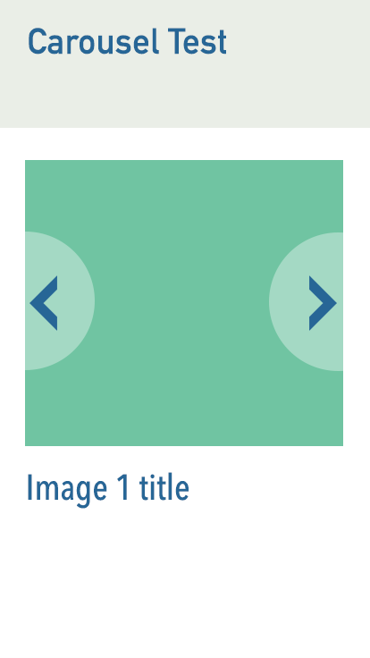

# Publicis.Sapient Front End Senior Associate Test

## Introduction
This is a standard test where we expect the developer to respond to several aspects:

1. Ensure the output reflects your understanding of the best current technology
2. Use of modular JavaScript patterns and/or a JS framework (e.g. Angular, Polymer, React, etc.) to build the necessary functionality
3. Show how a user interface can operate in different contexts 
3. Demonstrate your approach to using an API to retrieve data and content
4. Demonstrate your ability to deliver and enforce high code quality and maintainability
5. We'd like to see how you use Git in your workflow
6. Where possible to provide nice flourishes to demonstrate a flair

## Example of what you will be building

### Mobile

### Desktop

## Brief
Using the image above as a reference build a mobile-first carousel widget that cycles through twelve images via the `prev` and `next` buttons. These are styled differently depending on the viewport size.

To obtain the images please use a public API such as Flickr or Pixabay. Once they are available to the app load them into the carousel and enable the functionality for the buttons.

Feel free to use whatever tools seem most appropriate for managing styles.

Please do not spend more than four hours on this test. **It's not important to complete the code** in the time that you have, but it is important that you are able to demonstrate your thinking via documentation and additional information.

We do not expect a high amount of unit test coverage for this project given the short timeframe. However, we are keen to see tests for the most important functions.

Keep the carousel itself quite simple in terms of how it responds; it doesn't need to snap. Concentrate on the quality of the code.

### Typeface
Use `Ropa Sans` as the typeface for the text, which is available through [Google Fonts here](https://fonts.google.com/specimen/Ropa+Sans)

### Images
Use the SVG included in this directory for the arrow icons

## How it should work
* The 'active' carousel item is always centred in its container
* When you click the `prev` button, it should centre the previous item
* When you click the `next` button, it should centre the next item
* As you scale up the browser window more of the carousel becomes visible

## Evaluation criteria
We will assess your work on the following basis:

* Code structure, quality and consistency
* Technology choices
* Accessibility
* Performance
* Cross browser compatibility 
* Responsiveness
* Attention to detail
* Clear documentation
* Dependency management
* Test quality
* Git commit history

## Rules
* You can install any core library you like (e.g. React, Backbone, Angular, Ember, etc.) **BUT…**
* Please **DO NOT** use a 3rd party carousel plugin - we want to see your JS skills

### Git
Please initialise a new git repository and commit your changes whenever you feel necessary. We will review your git commit history log.

# Conclusion
When you've finished, please zip up the repository and email it to your Publicis.Sapient hiring contact.